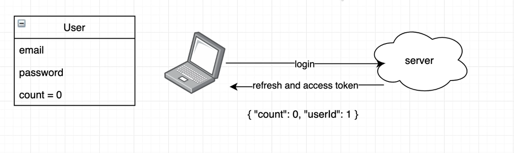
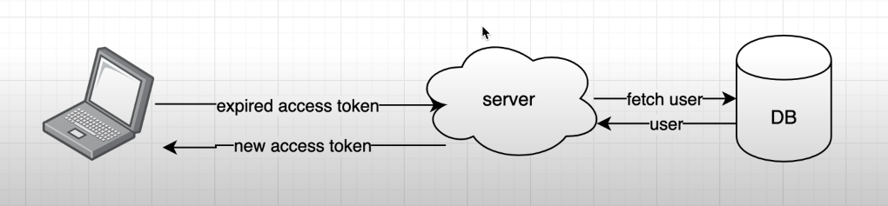
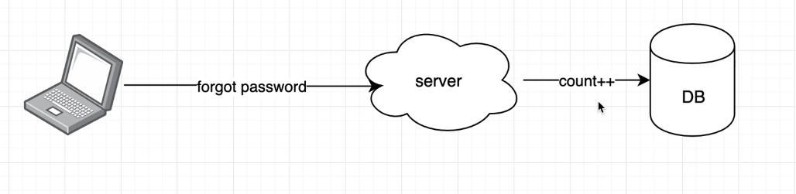
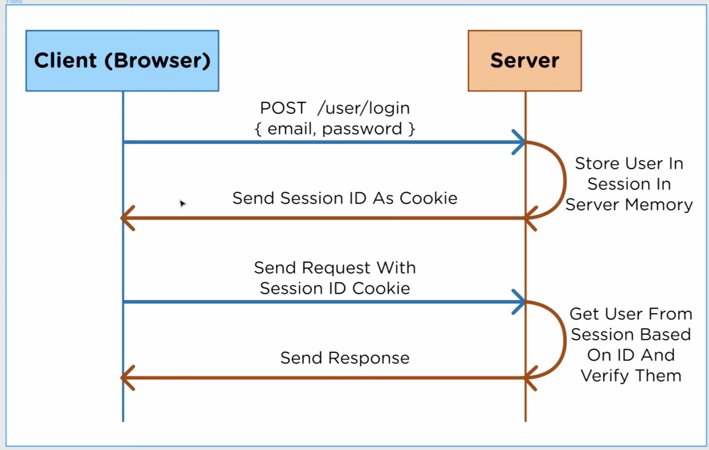
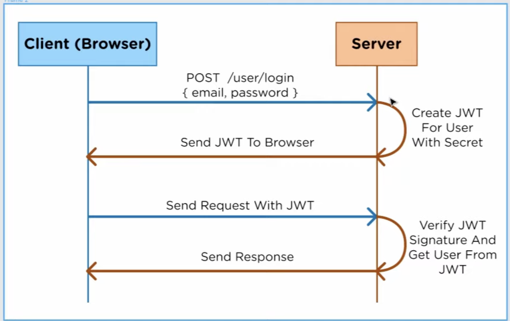
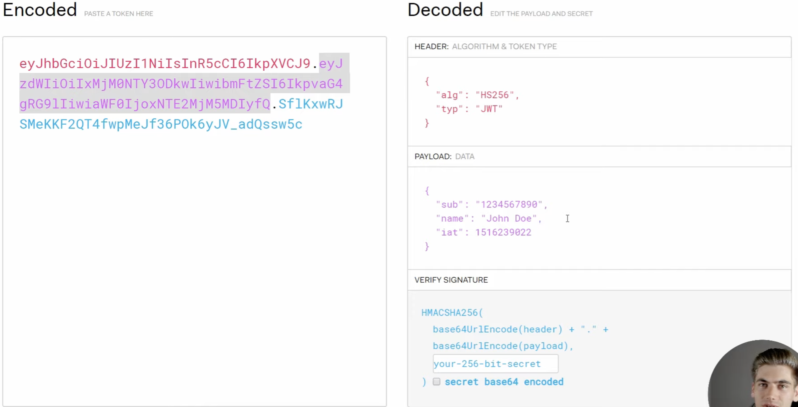

# JWT Tokens 101

- The user has a count value. This is the live version of the token you are using and is unique per user.
- When someone logs in to our app, we validate it and we send them 2 tokens.

1. A refresh token - long lived - 1 week/month. How we know user is logged In (Stores current user count in db)
2. An access token - short lived. So we don't have to access the DB again. (Stores user ID)

- We send back access tokens as "cookies"
- Without touching db we can see the user request.

## What happens when access token expires?

- If refresh token is not valid we request the user logs in again. Treat them as un unauthenticated user.
- If access token expires, fetch user from DB. We then compare count in refresh token to the count in the DB. If they match then we send the user a new access token.
- How do we invalidate tokens? (e.g. forgotten password/ hacked account) - we hit the database and we increment the value of the count in the database. This therefore invalidates the token preventing log ins.
-

# General notes from web dev simplified

- Authorization is about making sure that the user who sends requests to you, is that same user that logged in during the authentication process.
- This is normally done with a session ID that gets stored as a cookie. Instead of using a cookie, JWT uses a JSON web token.

### Traditional session storage cookie system

### JWT authentication

- JWT can be stored with cookie storage. The server will sign the JSON web token with its own secret key.
- Main difference- in session, user info is stored in the session. Whereas in the JWT the info is stored on the client. This means that you can use JWT across different servers.

# How does JWT sign tokens?

- Three parts of a JSON token

1. Header with algorithm type
2. Payload data included in the token. All application payload data. iat = issued data/time. We need tokens to expire to stop people authorising themselves as us.
3. Signature data - most important. Takes header and payload and encodes in base64. Uses algorithm defined in the header e.g. HS256 to encode the data. If client changes the data it won't match.

### example

Bank owns 2 servers.

1. Bank server
2. Retirement server

They want users to be able to log on into one of the servers, but be logged into both. They want a seamless user transistion. We store info on the client. Not on the server.
JWT allows us to do this! As long as you have the same secret key.

## Refresh token vs access tokens

Authentication systems are divided according to how they verify the user:
– Based on something known (password)
– Based on something possessed (identity card, usb, token)
– Based on physical characteristics (voice, fingerprints, eyes)

## problems with cookie based Authentication

- User logs in, server returns token that is stored as a cookie and saved in memory/on a DB in the server.
- Problems include: 1. Overload caused by all the authenticated users, scalability issues, if there are multiple instances of the server raised then they will all have to share the session information so you don't have to log in again.

## JWT to the rescue

- JWT is a stateless authentication method. The server does not store any information, nor does the session.
- When the user is authenticated with his credentials or any other method, he receives an access token in the answer (access token). From that moment on, all requests made to the API will carry this token in an HTTP header so that the server can identify which user makes the request without having to search the database or any other storage system.
- the application becomes scalable, since it is the client itself that stores its authentication information, and not the server. This way, requests can reach any instance of the server and can be attended without synchronization. This is also more secure

## What is JWT?

- JSON Web Token (JWT) is an open standard based on JSON to create access tokens that allow the use of application or API resources.
- They have a validity period. Once the validity period is reached the server will no longer allow access to resouces with the token. As a result the user will have to get a new access token by either A) reauthentication or B) refresh token.

## Types of token

1. Access token: It contains all the information the server needs to know if the user / device can access the resource you are requesting or not. They are usually expired tokens with a short validity period.
2. Refresh token: The refresh token is used to generate a new access token. Typically, if the access token has an expiration date, once it expires, the user would have to authenticate again to obtain an access token. With refresh token, this step can be skipped and with a request to the API get a new access token that allows the user to continue accessing the application resources.

## Problems with this method

- Although way more efficient with distributed cloud based system.
- Can still be hijacked by an attacker, can be difficult to invalidate, can be used to authenticate users in the background in the server.
